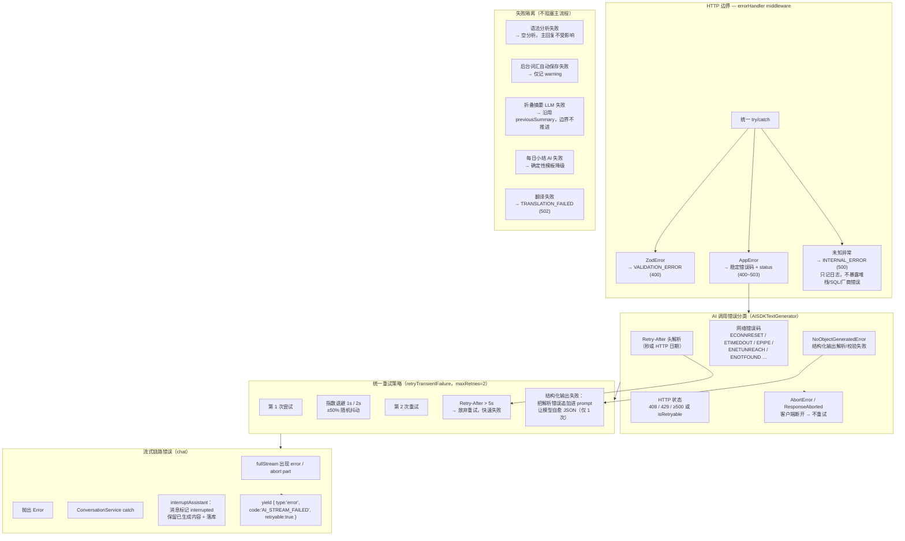
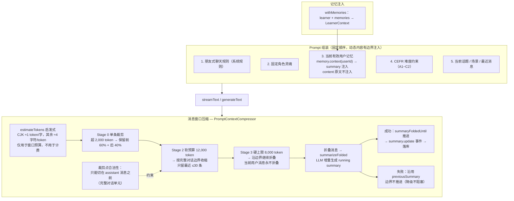
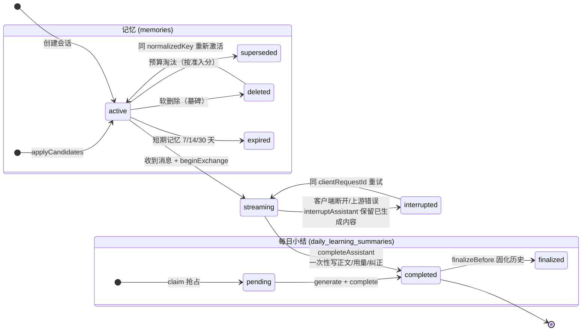
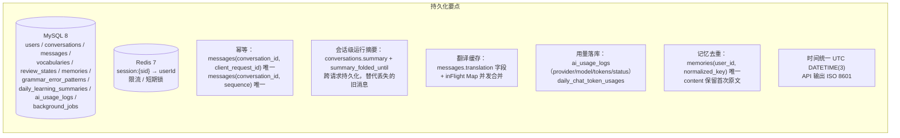
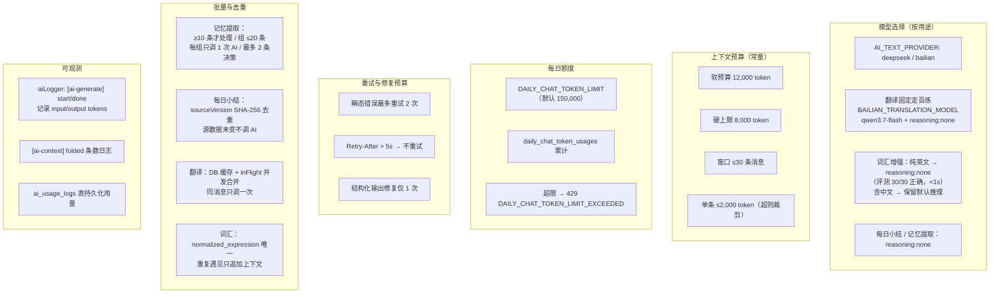

# Peper24 AI Agent 架构设计图（五维度）

> 对应 `docs/ai.md`、`docs/technical-design.md` 与 `app/module/ai` 的实际实现。
> 所有图可直接在 [mermaid.live](https://mermaid.live) 或支持 Mermaid 的编辑器中渲染。

## 1. 错误处理

## 2. 流程编排

```mermaid
flowchart TB
    subgraph ORCH["流式对话编排 — ConversationService.streamMessage"]
        ID["幂等检查<br/>clientRequestId 唯一索引"]
        ID -- "已存在且 completed" --> REPLAY["replay 已存消息<br/>（不重复调用 AI）"]
        ID -- "不存在" --> LIMIT["每日 Token 限额检查<br/>DAILY_CHAT_TOKEN_LIMIT"]
        LIMIT --> BEGIN["beginExchange 事务<br/>保存 user 消息 + 建 streaming 消息"]
        BEGIN --> PAR

        subgraph PAR["并行编排"]
            CHAT["主聊天流<br/>ai.chat() → AsyncIterable<ChatEvent>"]
            GRAM["并行语法分析<br/>ai.analyzeGrammar()<br/>.catch(→空分析)"]
            VOCAB["后台词汇增强<br/>extractEmbeddedChineseExpressions()<br/>确定性提取 ≤3 个中文表达<br/>enrichExpression → addFromConversation"]
        end

        CHAT --> SUM["summary.update 事件<br/>→ updateSummary 持久化折叠摘要"]
        CHAT --> DONE["message.done（含 usage）"]
        GRAM --> PREP["GrammarService.prepare<br/>按 grammar_error_patterns 决定是否展示"]
        PREP --> CORR["correction.ready 事件"]
        DONE --> COMPLETE["completeAssistant 事务<br/>正文 + 用量 + 纠正一次性落库"]
        COMPLETE --> EVENTS["yield message.done"]
    end

    subgraph MEMORY["记忆提取编排 — MemoryExtractionService（Worker/手动触发）"]
        M1["loadPendingMemoryGroups<br/>≥10 条 / 组 ≤20 条 / 最多 20 组"]
        M2["loadExtractionContext<br/>目标前 2 条 + target 完整消息"]
        M3["ai.extractMemories<br/>一次调用，最多 2 条决策"]
        M4["admitMemoryDecision 服务端复算<br/>来源校验 / 秘密拒绝 / 准入分门槛"]
        M5["applyCandidates<br/>normalizedKey 去重合并"]
        M6["markMessagesScanned<br/>成功或 shouldSave=false 都推进"]
        M1 --> M2 --> M3 --> M4 --> M5 --> M6
    end

    subgraph SUMMARY["每日小结编排 — LearningSummaryService（Schedule 24h / 按需）"]
        S1["aggregate 客观指标（消息/用量/错误/词汇/复习）"]
        S2["sourceVersion = SHA-256(metrics)<br/>源数据未变 → 不重复调用 AI"]
        S3["claim 行级抢占<br/>防并发重复生成"]
        S4["ai.generateDailyLearningSummary<br/>（失败 → 模板降级）"]
        S5["complete + finalizeBefore 固化历史"]
        S1 --> S2 --> S3 --> S4 --> S5
    end
```

## 3. 上下文管理

## 4. 状态与持久化

## 5. 成本控制

---

## 分层职责速查（AI 相关）

| 关注点 | 位置 | 机制 |
|---|---|---|
| 错误处理 | `AISDKTextGenerator` / `errorHandler` / `ConversationService` | 错误分类 → 重试 → 隔离 → 降级 → 稳定错误码 |
| 流程编排 | `ConversationService` / `MemoryExtractionService` / `LearningSummaryService` | 并行分析、后台任务、事务化提交、Worker 调度 |
| 上下文管理 | `PromptContextCompressor` / `ConversationPrompt` / `MemoryService` | 固定 Prompt 顺序、窗口裁剪/折叠、running summary、记忆注入 |
| 状态与持久化 | `Message` / `Conversation` / `Memory` / `DailyLearningSummary` 模型 | 消息状态机、幂等唯一索引、折叠摘要、软删除、UTC 存储 |
| 成本控制 | `ConfiguredTextModelProvider` / `ConversationService` / `PromptContextCompressor` | 按用途选模型、关闭 reasoning、上下文预算、每日限额、批量去重 |
