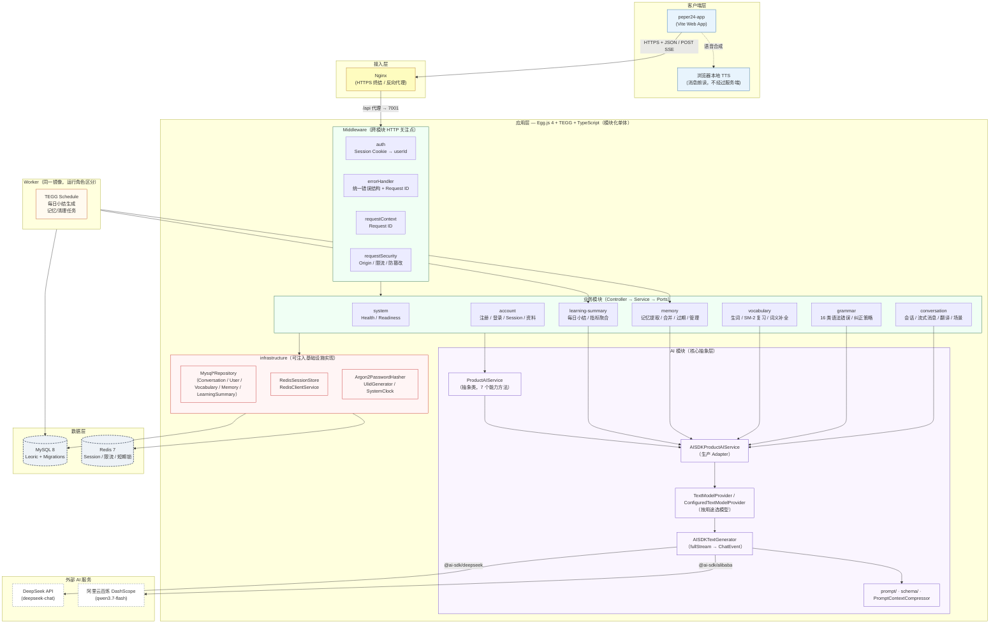
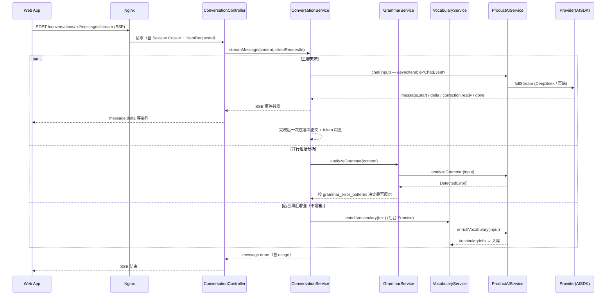

# Peper24 Server 架构图

> 本文件包含 Mermaid 源码，可在支持 Mermaid 的编辑器（VS Code、Typora、GitHub）中直接渲染。
> 渲染命令（可选）：`mmdc -i docs/architecture.md -o docs/architecture.svg -t default`

## 总体架构

## 核心调用链：一次流式对话

## 分层职责速查

| 层 | 职责 | 对应目录 |
|---|---|---|
| Middleware | 认证、错误、Request ID、安全 | `app/middleware/` |
| Controller | 协议转换、Schema 校验、身份上下文 | `app/module/*/controller/` |
| Service | 业务规则与用例编排（单测主对象） | `app/module/*/service/` |
| Ports | 可注入抽象接口（DI Token） | `app/module/*/service/*Ports.ts` |
| Model | Leoric 数据库映射 | `app/model/` |
| Infrastructure | MySQL / Redis / 工具实现 | `app/module/infrastructure/` |
| AI Provider | AI SDK 与厂商类型隔离 | `app/module/ai/provider/` |
| Prompt | 版本化 Prompt 模板 | `app/module/ai/prompt/` |
| Schema | Zod 输入输出与 AI 结构校验 | `app/module/*/schema/`、`app/module/ai/schema/` |
| Migrations | 唯一的生产结构变更入口 | `database/migrations/` |
| Schedule | Worker 定时任务 | `app/module/*/schedule/` |
