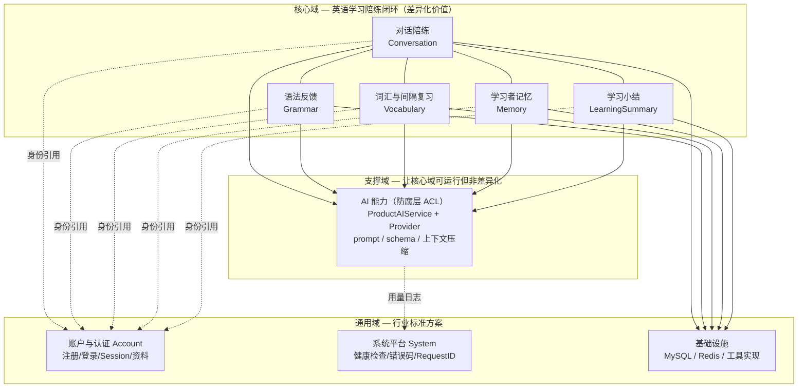
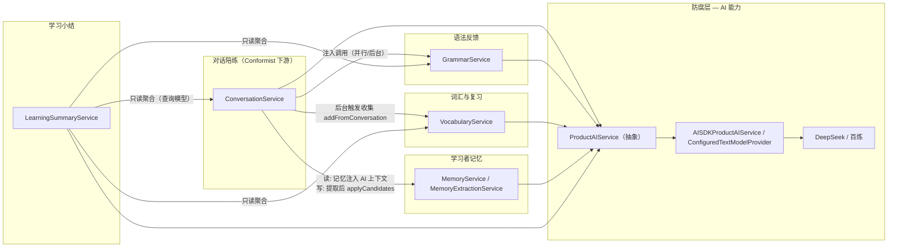

# Peper24 Server DDD 领域分析

> 依据：`docs/*.md` 全部模块文档 + `app/module/*` 实际代码。
> 视角：战略设计（子域分类、限界上下文、上下文映射）+ 战术设计（聚合、实体、值对象、领域服务、防腐层）。

## 1. 业务域总览（子域分类）

## 2. 业务域清单（战术要素）

| 域 | 分类 | 聚合根 | 聚合内实体/值对象 | 领域服务 / 规则 | 数据表 |
|---|---|---|---|---|---|
| **对话陪练** | 核心 | `Conversation` | `Message`（聚合内实体）、`Scene`、`ChatEvent`（值对象）、`ClientRequestId` | `ConversationService`：幂等屏障、sequence 递增、中断恢复、流式编排 | `conversations`、`messages` |
| **语法反馈** | 核心 | `GrammarErrorPattern` | `GrammarErrorOccurrence`、`Correction`、16 类 `GrammarErrorType`（值对象） | `GrammarService.prepare`：归一化/去重/分组；**第 2 次纠正规则**（occurrence_count===2 && !corrected_at） | `grammar_error_patterns`、`grammar_error_occurrences` |
| **词汇与间隔复习** | 核心 | `Vocabulary` | `ReviewState`、`VocabularyContext`、`ReviewResult`（again/hard/good/easy 值对象） | `VocabularyService` + `ReviewScheduler`（SM-2 纯函数）、normalizedExpression 去重、来源消息校验 | `vocabularies`、`vocabulary_contexts`、`review_states`、`review_logs` |
| **学习者记忆** | 核心 | `Memory` | `MemorySource`、`MemoryChangeLog`、`MemoryType`/`AdmissionScore`/`normalizedKey`（值对象） | `MemoryService`（合并/淘汰/过期/软删除）、`MemoryExtractionService`（AI 提取编排）、`MemoryAdmissionPolicy`（准入分复算、秘密拒绝） | `memories`、`memory_sources`、`memory_change_logs` |
| **学习小结** | 核心 | `DailyLearningSummary` | `DailyLearningMetrics`、`SummaryContent`（值对象）、`sourceVersion`（SHA-256） | `LearningSummaryService`：上海自然日聚合、claim 防并发、模板降级、finalize 固化 | `daily_learning_summaries` |
| **AI 能力** | 支撑（防腐层） | 无业务聚合 | `ChatEvent`、`LearnerContext`、结构化输出 Schema（值对象） | `ProductAIService`（抽象）+ `AISDKProductAIService`（适配器）、`ConfiguredTextModelProvider`、`PromptContextCompressor` | `ai_usage_logs`（技术观测） |
| **账户认证** | 通用 | `User` | `UserProfile`、`CEFRLevel`/`Email`（值对象） | `AccountService`：Argon2id、Session 轮换、邮箱归一化 | `users`、`user_profiles` |
| **系统平台** | 通用 | — | 统一错误结构、Request ID | `ReadinessService`、`errorHandler` | — |

## 3. 上下文映射（限界上下文协作）

## 4. DDD 观察

### 做得好的地方

1. **防腐层清晰**：`ProductAIService` 是所有业务域与 LLM 厂商之间的典型 ACL——业务代码看不到 AI SDK、DeepSeek、百炼类型，厂商事件在 Provider 层转换为产品自己的 `ChatEvent`。
2. **聚合边界务实**：每个业务模块有独立 `*Ports.ts`（仓储接口）+ 独立表 + 明确不变量（sequence 递增、clientRequestId 幂等、normalizedExpression 唯一、记忆预算上限）。
3. **纯领域逻辑被提取为纯函数**：`ReviewScheduler`（SM-2）、`MemoryAdmissionPolicy`（准入复算）、`GrammarService.prepare`（归一化分组）都是无 IO 的纯函数——可单测、可确定性验证。
4. **跨域只读聚合做成查询模型**：`LearningSummaryService.aggregate` 跨表只读统计，类似 CQRS 读模型，不污染各域写路径。
5. **模块化单体 + Ports & Adapters**：`docs/modules.md` 明确声明 DI 注入 + 内存实现测试，域间依赖通过公开 Service。

### 与经典 DDD 的差距（务实取舍，非缺陷）

1. **贫血模型 / 事务脚本**：`Record` 是贫血数据结构，业务规则集中在 Service 方法中，没有充血领域模型。对"CRUD + AI 编排"类系统是常见务实选择，但"第 2 次纠正规则""SM-2 节奏""记忆预算"这类核心规则目前散落在 Service/Repository 里，缺少一个显式的领域对象承载。
2. **纠正触发规则落在基础设施层**：`docs/grammar.md` 明确写出"纠正触发机制（在 `MysqlConversationRepository` 中）"——业务规则（occurrence_count===2 才纠正）写在 Repository 实现里，而非领域服务。与 `AGENTS.md`"model 不包含业务规则"的约定有张力，属于最明显的战术违例。
3. **无显式领域事件**：对话完成 → 词汇收集、记忆提取、小结刷新，全是**直接服务调用或轮询**（`ConversationService` 直接注入 `GrammarService`/`VocabularyService`/`MemoryService`），没有 `message.completed`、`memory.updated` 这类领域事件。后果：BC 之间强耦合、扩展新订阅方（如未来加"发音评测"）要改 ConversationService。
4. **跨域依赖是"注入具体类"而非"事件/消息"**：虽然模块化了，但 BC 之间通过单例 Service 强引用协作；若未来拆分服务（如 Worker 独立部署），需要先引入事件通道。
5. **没有独立的 Domain 层**：`app/module/*/service` 是应用服务与领域逻辑的混合体，`app/model` 是 Leoric 映射（含持久化字段）。经典 DDD 的 `domain/`（实体+值对象+领域服务）与 `infrastructure/`（仓储实现）分离没有完全落地——但项目目录约定已隐含了这一意图。

### 演进建议（按优先级）

1. **把纠正触发规则从 Repository 移到领域服务**：在 `GrammarService` 暴露 `recordOccurrences()`，Repository 只做持久化——消除最明显的规则错位。
2. **引入轻量领域事件**：至少为"消息完成"发布事件，让词汇收集、记忆扫描、小结刷新成为订阅方；项目已声明一期不用消息中间件，可用进程内 Event Bus 或直接保留轮询但收敛到明确的事件端口。
3. **对核心规则建立领域对象**：`GrammarErrorPattern`、`ReviewState`、`Memory` 三个聚合可逐步从贫血 Record 演进为携带行为（纠正判定、SM-2 调度、准入预算）的对象，规则从 Service 移入聚合，测试更贴近业务语言。
4. **明确防腐层归属**：`ai_usage_logs`、`daily_chat_token_usages` 目前挂在 AI/Conversation 侧，可归入统一的"平台观测"通用域，避免业务域承担计费职责。
